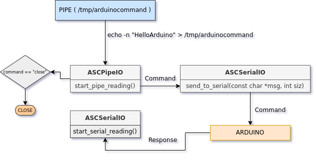

# Arduino Serial Control
Controlling arduino using serial communication. Currently only **UNIX** like systems supported.
Tested under:

- Archlinux 5.13.9
- CMake version 3.21.3
- GCC version 10.2.0
- Arduino Ide version 1.8.9
- Arduino-CMake-Toolchain
- avrdude version 6.3 
- Arduino Uno R3

## Features
- [x] Communication arduino over serial cable.
- [x] Reading/Displaying messages coming from arduino.
- [x] Sending commands to arduino that coming from named pipe. (default */tmp/arduinocommand* ) 
- [ ] ZMQ sockets support.
- [ ] JSON processing.
- [ ] Logging support.

## Requirements
- C++17 compliant compiler
- CMake version >= 3.6.3 ( CMake > 3.8 for building Arduino code)
- **Arduino-CMake-Toolchain** for compiling arduino code. (see [ArduinoCMakeToolchain](https://github.com/a9183756-gh/Arduino-CMake-Toolchain))
- **avrdude** for flashing compiled code to arduino.

## Building ArduinoSerialControl
	mkdir -p build && cd build && cmake ../
	make

### Usage
	./ArduinoSerialControl <ARDUINO_USB_PORT>
	
### Example
	./ArduinoSerialControl /dev/ttyUSB0
	echo -n "Hello Arduino" > /tmp/arduinocommand
	# For closing communication
	echo -n "close" > /tmp/arduinocommand

## Workflow Diagram

## Building & Flashing Arduino code
You must install **arduino ide** and **arduino-cmake-toolchain** for building arduino code and flashing it to arduino using **avrdude.**

### Steps

### 1. Build Arduino code(see [Arduino-CMake-Toolchain](https://github.com/a9183756-gh/Arduino-CMake-Toolchain))
	#1 Go to example arduino code
	cd arduino-examples/arduino-serial-communication/build
	
	#2 Uncomment your arduino from BoardOptions.cmake ( set(ARDUINO_BOARD, "avr.uno")
	vim BoardOptions.cmake

	#3 Generate makefile	
	cmake -D ARDUINO_INSTALL_PATH=<ARDUINO_IDE_PATH> -D CMAKE_TOOLCHAIN_FILE=<ARDUINO_CMAKE_TOOLCHAIN_FILE> ../
	
	#4 Build IT !
	make
			

### 2. Flash to Arduino
	# Go to arduino example directory ( generated hex file )
	cd arduino-examples/arduino-serial-communication/build
	./flash.sh <terminal_device>
	# Example
	./flash.sh /dev/ttyUSB0

## Documentation
Doxygen generated documents can be viewed in docs folder. [Doxygen generated html documentation.](./docs/html/index.html) 

### Generating documents
For generating documentation you need [doxygen](https://github.com/doxygen/doxygen).

	doxygen Doxyfile

## Testing
	TODO

## Notes
User must has permission to access serial port and use ArduinoSerialControl. For example:

	sudo usermod -a -G uucp,tty <username> 

### Flashing to arduino
Flashing to arduino only tested in **ArduinoUnoR3**. You should change avrdude command in **flash.sh** script. The format of the avrdude command follows:
	
	avrdude -v -p <chipset> -c <programmer> -P <device> -b <baud_rate> -D -U flash:w:<hexfile>:i
	
For example:
	
	avrdude -v -p atmega328p -c arduino -P /dev/ttyUSB0 -b 115200 -D -U flash:w:./arduino_serial_communication.hex:i	 
